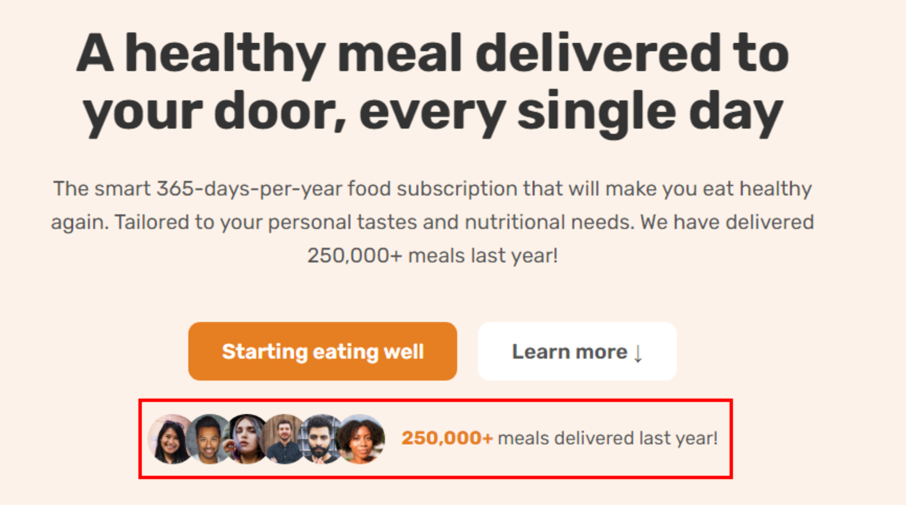
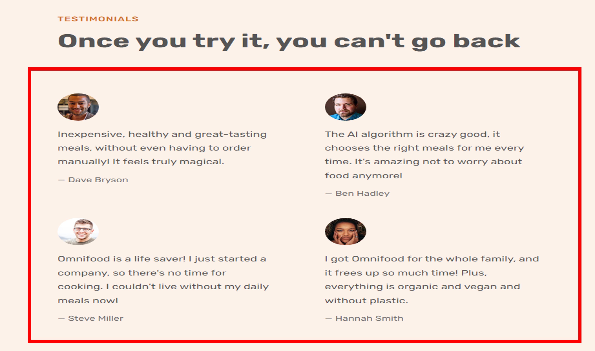

### delivered


```javascript
const displayDeliveredItems = Item => {
  let deliveredItem = Item.map(item => {
    return `
      `;
  });
  deliveredImgs.innerHTML = deliveredItem;
};
```


### logos


```javascript
const displaylogItems = Item => {
  let logItem = Item.map(item => {
    return `
    `;
  });
  logoImgs.innerHTML = logItem;
};
```

### monialItems


```javascript
const displaytestimonialItems = monial => {
  monial.forEach((element, index) => {
    const html = `
    <figure class="testimonial">
      
      <blockquote class="testimonial-text">
        ${element.text}
      </blockquote>
      <p class="testimonial-name">${element.name}</p>
    </figure>`;
    
    testimonialImgs.insertAdjacentHTML('beforeend', html);
  });
};
```

### gallery (這張因視窗太小而跑版，實際是正常)

```javascript
const displaygalleryItems = gallery => {
  gallery.forEach(element => {
    const galleryhtml = `
    <figure class="gallery-item">
    
    <!-- <figcaption>Caption</figcaption> -->
  </figure>`;

  galleryImgs.insertAdjacentHTML('afterbegin', galleryhtml);
  })
}
```

## 甘苦談
還行，普普通通吧

## 困難點
1. document.querySelector('# or .') 要清楚設錯事件不會發生會很懊惱
2. HTML element 要清楚些
3. callback 要清楚些(map, forEach, for...in) 

## 自主學習
目前都聽得懂 結束